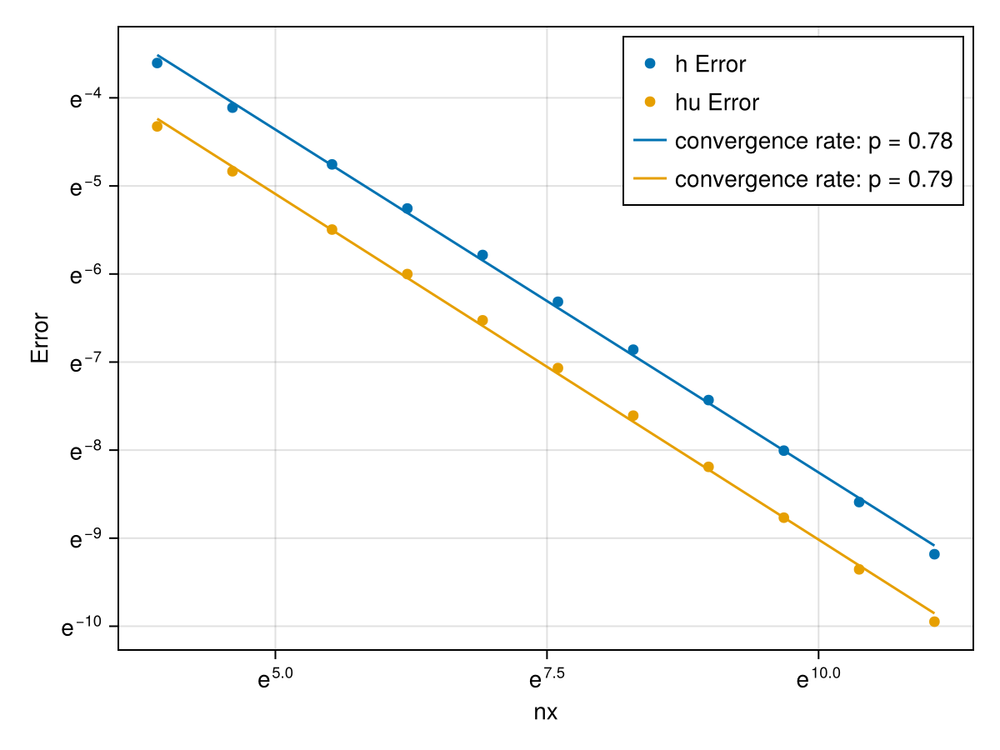

## Convergence to the exact solution

We benchmark the 1D shallow-water finite volume solver against the exact solution of the **wet dam-break problem** on a flat bottom. The initial condition is

```math
h(x,0)=
\begin{cases}
h_L, & x<0,\\
h_R, & x\ge 0,
\end{cases}
\qquad
(hu)(x,0)=0,
\qquad
h_L>h_R>0.
```

The exact solution is self-similar with $\xi=x/t$ and consists of a **left rarefaction**, a **middle constant state**, and a **right shock**. For $t>0$,

```math
h(x,t)=
\begin{cases}
h_L, & \xi < -\sqrt{g h_L},\\
\dfrac{1}{9g}\left(2\sqrt{g h_L}-\xi\right)^2,
& -\sqrt{g h_L} \le \xi \le u_{*} - \sqrt{g h_{*}},\\
h_{*}, & u_{*} - \sqrt{g h_{*}} < \xi < s,\\
h_R, & \xi \ge s,
\end{cases}
```

and

```math
(hu)(x,t)=
\begin{cases}
0, & \xi < -\sqrt{g h_L},\\
h(\xi)\,\dfrac{2}{3}\left(\xi+\sqrt{g h_L}\right),
& -\sqrt{g h_L} \le \xi \le u_{*} - \sqrt{g h_{*}},\\
h_{*}u_{*}, & u_{*} - \sqrt{g h_{*}} < \xi < s,\\
0, & \xi \ge s.
\end{cases}
```
The analytical solution used here is the classical Stoker solution for the wet dam-break problem [Stoker, 1957].




The numerical solution is compared to this exact solution at a fixed time $T$. The plot below shows the error versus the number of cells $N_x$. Since the dam-break solution contains a shock, the global convergence rate is expected to be approximately **first order**.
