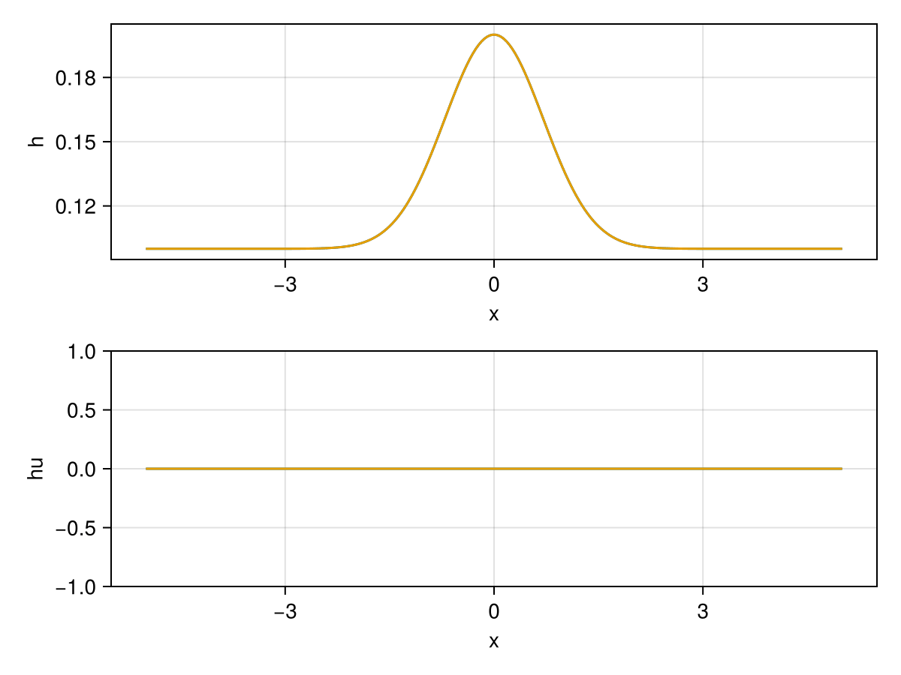
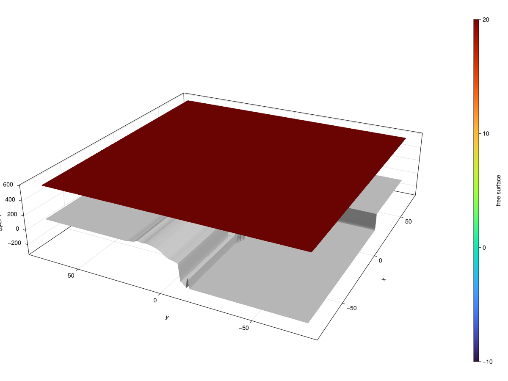

# ShallowWaterEquations

[](https://github.com/USER/REPOSITORY/actions/workflows/CI.yml)  

**Project info**

This repository is the final project for the course *Solving partial differential equations in parallel on GPUs II* at ETH Zürich.  
Authors: *Ramura Gassler (rgassler@ethz.ch), Ijiri*.

The main goal of this project is the development of **parallel 2D shallow-water equation (SWE) solvers** in Julia:

- a **single-XPU** implementation using [`ParallelStencil.jl`](https://github.com/omlins/ParallelStencil.jl), running on CPUs or GPUs from one code base,
- a **multi-XPU** implementation using [`ImplicitGlobalGrid.jl`](https://github.com/eth-cscs/ImplicitGlobalGrid.jl), extending the solver to domain-decomposed MPI runs,
- a **well-balanced wet/dry solver** for shallow-water flow over non-flat bathymetry,
- CPU and reference implementations for verification,
- visualization and post-processing scripts for generated simulation output.

The numerical focus is a first-order finite-volume SWE solver with Rusanov fluxes, bottom topography, free-surface-based well-balancing, wet/dry stabilization, and an absorbing sponge layer. The software focus follows a similar workflow as the PorousConvection project from the first part of this course: start from a serial/reference formulation, port the solver to a single CPU/GPU backend with `ParallelStencil.jl`, and then extend it to distributed multi-XPU simulations with `ImplicitGlobalGrid.jl`.

## Contents

- [Introduction](#introduction)
- [Physical model](#physical-model)
- [Numerical method and parallelisation](#numerical-method-and-parallelisation)
- [Setup](#wrench-setup)
- [Run the simulations](#rocket-run-the-simulations)
- [Repository structure](#package-repository-structure)
- [1D SWE reference problems](#1d-swe-reference-problems)
- [2D SWE baseline solver](#2d-swe-baseline-solver)
- [2D SWE single-XPU solver](#2d-swe-single-xpu-solver)
- [2D well-balanced SWE single-XPU solver](#2d-well-balanced-swe-single-xpu-solver)
- [2D SWE multi-XPU solver](#2d-swe-multi-xpu-solver)
- [2D well-balanced SWE multi-XPU solver](#2d-well-balanced-swe-multi-xpu-solver)
- [Diagnostics, reference solutions, and testing](#white_check_mark-diagnostics-reference-solutions-and-testing)
- [Visualization and output processing](#visualization-and-output-processing)
- [Automatic documentation in Julia](#automatic-documentation-in-julia)
- [Discussion and outlook](#discussion-and-outlook)

---

## Introduction

The shallow water equations describe depth-averaged free-surface flows in regimes where the horizontal length scale is much larger than the water depth. They are widely used for wave propagation, dam-break problems, tsunami modelling, coastal inundation, and flow over varying bathymetry.

From a numerical point of view, the shallow water equations are challenging because they combine:

- nonlinear hyperbolic wave propagation,
- source terms caused by bottom topography,
- equilibrium states such as a **lake at rest**,
- wet/dry interfaces where water depth approaches zero,
- large explicit finite-volume workloads that are well suited for data-parallel execution.

This project therefore has two tightly connected goals:

1. **Develop a physically robust SWE solver**
   - conservative finite-volume discretisation,
   - Rusanov numerical fluxes,
   - topographic source terms,
   - well-balanced lake-at-rest treatment,
   - wet/dry stabilization and draining timestep,
   - absorbing sponge layers for outgoing waves.

2. **Parallelise the solver efficiently**
   - CPU/GPU backend abstraction through `ParallelStencil.jl`,
   - stencil-style kernels written once and executed on different backends,
   - multi-XPU domain decomposition through `ImplicitGlobalGrid.jl`,
   - halo exchange and global reductions for distributed simulations,
   - shell scripts for local and cluster-oriented execution.

The repository also contains smaller 1D solvers and reference scripts. These are useful for understanding and validating the shallow-water discretisation before studying the full parallel 2D implementations.

## Physical model

### Conserved variables

For the 2D shallow water equations, the conserved state is

$$
U =
\begin{bmatrix}
h\\
hu\\
hv
\end{bmatrix},
$$

where

- $h(x,y,t)$ is the water depth,
- $u(x,y,t)$ is the depth-averaged velocity in the $x$-direction,
- $v(x,y,t)$ is the depth-averaged velocity in the $y$-direction,
- $hu$ and $hv$ are the depth-integrated momentum components,
- $z(x,y)$ denotes the fixed bottom topography.

The free-surface elevation is

$$
\eta = h + z.
$$

### Governing equations

The 2D SWE with fixed bathymetry are

$$
\partial_t h
+
\partial_x(hu)
+
\partial_y(hv)
=
0,
$$

$$
\partial_t(hu)
+
\partial_x\left(hu^2 + \frac{1}{2}gh^2\right)
+
\partial_y(huv)
=
-gh\,\partial_x z,
$$

$$
\partial_t(hv)
+
\partial_x(huv)
+
\partial_y\left(hv^2 + \frac{1}{2}gh^2\right)
=
-gh\,\partial_y z.
$$

In balance-law form,

$$
\partial_t U
+
\partial_x F(U)
+
\partial_y G(U)
=
S(U),
$$

with

$$
F(U)
=
\begin{bmatrix}
hu\\[1ex]
hu\,u+\frac{1}{2}gh^2\\[1ex]
hu\,v
\end{bmatrix},
\qquad
G(U)
=
\begin{bmatrix}
hv\\[1ex]
hv\,u\\[1ex]
hv\,v+\frac{1}{2}gh^2
\end{bmatrix},
$$

and

$$
S(U)
=
\begin{bmatrix}
0\\[1ex]
-gh\,\partial_x z\\[1ex]
-gh\,\partial_y z
\end{bmatrix}.
$$

### Lake-at-rest equilibrium

A central steady state is the lake-at-rest solution

$$
u=v=0,
\qquad
\eta=h+z=\text{constant}.
$$

A method is **well-balanced** if it preserves this equilibrium exactly, up to roundoff.

---

## Numerical method and parallelisation

### Finite-volume update

The computational domain is divided into Cartesian cells.  
Each cell $(i,j)$ stores

$$
U_{i,j}
=
\begin{bmatrix}
h_{i,j}\\
(hu)_{i,j}\\
(hv)_{i,j}
\end{bmatrix}.
$$

The explicit first-order finite-volume update is

$$
U^{n+1}_{i,j}
=
U^n_{i,j}
-
\frac{\Delta t}{\Delta x}
\left(
F_{i+1/2,j}-F_{i-1/2,j}
\right)
-
\frac{\Delta t}{\Delta y}
\left(
G_{i,j+1/2}-G_{i,j-1/2}
\right)
+
\Delta t\,S_{i,j}.
$$

The implemented workflow uses:

- piecewise-constant reconstruction,
- explicit timestepping,
- Rusanov / local Lax–Friedrichs fluxes,
- CFL-based timestep selection,
- reflective or absorbing outer-domain treatment depending on the script,
- optional visualization or serialized array output.

### Rusanov flux

In the $x$-direction,

$$
\widehat{F}(U_L,U_R)
=
\frac{1}{2}
\left[
F(U_L)+F(U_R)
\right]
-
\frac{1}{2}
a_{\max}
\left(
U_R-U_L
\right),
$$

where

$$
a_{\max}
=
\max
\left(
|u_L|+\sqrt{gh_L},
|u_R|+\sqrt{gh_R}
\right).
$$

In the $y$-direction,

$$
\widehat{G}(U_L,U_R)
=
\frac{1}{2}
\left[
G(U_L)+G(U_R)
\right]
-
\frac{1}{2}
b_{\max}
\left(
U_R-U_L
\right),
$$

with

$$
b_{\max}
=
\max
\left(
|v_L|+\sqrt{gh_L},
|v_R|+\sqrt{gh_R}
\right).
$$

### CFL timestep

The explicit timestep is chosen from a CFL condition.  
A representative 2D form is

$$
\Delta t
=
\frac{\mathrm{CFL}}
{
\max_{i,j}
\left(
\frac{|u_{i,j}|+\sqrt{gh_{i,j}}}{\Delta x}
+
\frac{|v_{i,j}|+\sqrt{gh_{i,j}}}{\Delta y}
\right)
}.
$$

The multi-XPU solver computes local speed extrema and uses MPI reductions to obtain globally consistent timestep information.

### Well-balanced free-surface reconstruction

A standard topographic finite-volume discretisation is not automatically well-balanced.  
If the mass flux diffuses $h_R-h_L$, then even a lake at rest may generate artificial transport because

$$
h_R-h_L \neq 0
$$

over non-flat bathymetry, even when

$$
\eta_R-\eta_L = 0.
$$

The well-balanced implementation therefore reconstructs the free surface

$$
\eta=h+z
$$

and evaluates interface water depths against a face bathymetry.

At the $x$-interface $i+1/2,j$,

$$
z_{i+1/2,j}
=
\frac{z_{i,j}+z_{i+1,j}}{2},
$$

$$
\eta_L=h_{i,j}+z_{i,j},
\qquad
\eta_R=h_{i+1,j}+z_{i+1,j},
$$

$$
h_L
=
\max\left(0,\eta_L-z_{i+1/2,j}\right),
$$

$$
h_R
=
\max\left(0,\eta_R-z_{i+1/2,j}\right).
$$

The same construction is used at $y$-interfaces.

### Well-balanced mass flux

The core first-order replacement is

$$
\boxed{
F_{1,i+1/2,j}
=
\frac{1}{2}\left[(hu)_L+(hu)_R\right]
-
\frac{1}{2}a_{i+1/2,j}(\eta_R-\eta_L)
}
$$

instead of diffusing $h_R-h_L$.  
Similarly,

$$
\boxed{
G_{1,i,j+1/2}
=
\frac{1}{2}\left[(hv)_L+(hv)_R\right]
-
\frac{1}{2}b_{i,j+1/2}(\eta_R-\eta_L)
}.
$$

At lake at rest,

$$
\eta_R-\eta_L=0,
$$

so no artificial mass flux is generated.

### Well-balanced source term

For cell $(i,j)$ define

$$
z_E = \frac{z_{i,j}+z_{i+1,j}}{2},
\qquad
z_W = \frac{z_{i-1,j}+z_{i,j}}{2},
$$

$$
z_N = \frac{z_{i,j}+z_{i,j+1}}{2},
\qquad
z_S = \frac{z_{i,j-1}+z_{i,j}}{2}.
$$

Let

$$
\eta_C=h_{i,j}+z_{i,j}.
$$

Then the face depths used by the source term are

$$
h_E=\max(0,\eta_C-z_E),
\qquad
h_W=\max(0,\eta_C-z_W),
$$

$$
h_N=\max(0,\eta_C-z_N),
\qquad
h_S=\max(0,\eta_C-z_S).
$$

The source terms are discretised as

$$
S^{(2)}_{i,j}
=
-g\,
\frac{h_E+h_W}{2}
\frac{z_E-z_W}{\Delta x},
$$

$$
S^{(3)}_{i,j}
=
-g\,
\frac{h_N+h_S}{2}
\frac{z_N-z_S}{\Delta y}.
$$

In the fully wet lake-at-rest case, this discrete source treatment cancels the hydrostatic pressure imbalance.

### Wet/dry stabilization

Near shorelines, direct division

$$
u=\frac{hu}{h},
\qquad
v=\frac{hv}{h}
$$

can produce unstable velocities when $h$ is very small.  
The well-balanced scripts therefore use a desingularized velocity evaluation:

$$
\boxed{
u =
\frac{
\sqrt{2}\,h\,(hu)
}{
\sqrt{h^4+\max(h^4,\varepsilon_{\mathrm{vel}})}
}
}
$$

$$
\boxed{
v =
\frac{
\sqrt{2}\,h\,(hv)
}{
\sqrt{h^4+\max(h^4,\varepsilon_{\mathrm{vel}})}
}
}
$$

with

$$
\varepsilon_{\mathrm{vel}}
=
\min(\Delta x,\Delta y)^4.
$$

The scripts additionally apply dry-cell cleanup:

$$
h<h_\varepsilon
\quad\Longrightarrow\quad
h=0,\qquad hu=0,\qquad hv=0.
$$

### Draining timestep

To prevent a cell from losing more water than it contains during one update, a first-order draining timestep is applied.  
For cell $(i,j)$,

$$
R_{i,j}
=
\frac{
\max(F_{1,E},0)+\max(-F_{1,W},0)
}{\Delta x}
+
\frac{
\max(G_{1,N},0)+\max(-G_{1,S},0)
}{\Delta y}.
$$

The local draining time is

$$
\Delta t^{\mathrm{drain}}_{i,j}
=
\begin{cases}
\min\left(\Delta t,\dfrac{h_{i,j}}{R_{i,j}}\right),
& R_{i,j}>0,\\[2ex]
\Delta t,
& R_{i,j}=0.
\end{cases}
$$

Outgoing face fluxes use the draining timestep of the upwind donor cell.

### Absorbing sponge layer

The 2D wave simulations use an enlarged computational domain together with a sponge layer near the outer region.  
The sponge layer damps momentum according to

$$
hu \leftarrow (1-\sigma)\,hu,
\qquad
hv \leftarrow (1-\sigma)\,hv.
$$

This is separate from the wet/dry treatment.  
Its role is to reduce artificial boundary reflections when waves propagate away from the area of interest.

---

### ParallelStencil.jl: single-XPU implementation

The core parallel 2D implementations are located in `src/xpu/`.  
The single-XPU scripts use

```julia
using ParallelStencil
using ParallelStencil.FiniteDifferences2D
```

and initialize either a CPU threading backend or a GPU backend:

```julia
@static if USE_GPU
    @init_parallel_stencil(CUDA, Float64, 2, inbounds=false)
else
    @init_parallel_stencil(Threads, Float64, 2, inbounds=false)
end
```

The numerical work is expressed through stencil-friendly parallel kernels using macros such as

```julia
@parallel_indices (ix, iy) function kernel!(...)
    ...
end
```

This makes the update sequence portable between:

- threaded CPU execution,
- GPU execution,
- performance-oriented benchmarking variants.

The well-balanced single-XPU code includes parallel kernels for:

- interface wave-speed computation,
- Rusanov flux evaluation,
- draining timestep computation,
- flux-based water-depth updates,
- momentum updates with topographic source terms,
- wet/dry cleanup,
- sponge-layer damping.

### ImplicitGlobalGrid.jl: multi-XPU implementation

The multi-XPU solver extends the same stencil-based workflow to distributed runs.  
It uses

```julia
using ImplicitGlobalGrid
import MPI
```

and initializes a decomposed global grid through

```julia
me, dims, nprocs, coords, comm_cart =
    init_global_grid(nx, ny, 1; select_device=false)
```

Each MPI rank evolves its local subdomain.  
Neighbour exchanges are handled through halo communication, e.g.

```julia
update_halo!(h, hu, hv)
```

and the global setup is finalized through

```julia
finalize_global_grid()
```

The multi-XPU solver keeps the numerical structure of the single-XPU solver while adding:

- Cartesian process topology,
- global index helpers,
- halo exchange of conserved fields,
- MPI reductions for global diagnostics/timestep data,
- distributed output workflow.

This is the main scalability step of the project: the same SWE stencil kernels are used in a distributed-memory simulation workflow analogous to the multi-GPU porous-convection implementation.

## :wrench: Setup

**Julia:** ≥ 1.9 recommended

**Main packages used across the repository:**

- `ParallelStencil`
- `ImplicitGlobalGrid`
- `MPI`
- `CUDA`
- `GLMakie`
- `StaticArrays`
- `Serialization`
- `Random`
- `Printf`

Instantiate the project environment from the repository root:

```bash
julia --project -e 'using Pkg; Pkg.instantiate()'
```

The repository contains additional implementation notes in:

- `src/2d_with_z/README.md`
- `src/xpu/README.md`

These can document solver-specific settings and script-level workflows.

## :rocket: Run the simulations

### Local Julia execution

From the repository root, individual scripts can be started with

```bash
julia --project src/xpu/2d_swe_xpu.jl
```

or, for the well-balanced single-XPU implementation,

```bash
julia --project src/xpu/2d_swe_xpu_wb.jl
```

The CPU reference implementation can be run through

```bash
julia --project src/xpu/2d_swe_cpu.jl
```

### Provided shell scripts

The `run_files/` folder contains wrapper scripts for the main workflows:

```bash
run_files/
├─ run_2D_swe_compression.sh
├─ run_2D_swe_multi_xpu.sh
├─ run_2D_swe_xpu_wb.sh
└─ run_2D_swe_xpu.sh
```

These scripts are intended to provide a reproducible entry point for:

- standard single-XPU runs,
- well-balanced single-XPU runs,
- distributed multi-XPU runs,
- output/compression workflows.

### Single-XPU workflow

Typical development runs use the XPU scripts with either the CPU threading backend or a GPU backend selected inside the Julia file:

```julia
const USE_GPU = false
```

or

```julia
const USE_GPU = true
```

Representative commands:

```bash
julia --project src/xpu/2d_swe_xpu.jl
julia --project src/xpu/2d_swe_xpu_wb.jl
```

### Multi-XPU workflow

The distributed runs use the multi-XPU scripts:

```bash
julia --project src/xpu/2d_swe_multi_xpu.jl
julia --project src/xpu/2d_swe_multi_xpu_wb.jl
```

On an MPI-enabled environment, these should be launched through the appropriate MPI or scheduler command, or through the repository wrapper script:

```bash
bash run_files/run_2D_swe_multi_xpu.sh
```

### Example cluster-style launch

A cluster launch can follow the same conceptual structure as the PorousConvection multi-XPU workflow:

```bash
export MPICH_GPU_SUPPORT_ENABLED=1
export IGG_CUDAAWARE_MPI=1
export JULIA_CUDA_USE_COMPAT=false

srun -N <nodes> -n <tasks> --ntasks-per-node=<tasks-per-node> \
     --gpus-per-task=1 \
     julia --project src/xpu/2d_swe_multi_xpu_wb.jl
```

Adapt resource requests, account settings, and module/uenv handling to the target machine.

## :package: Repository Structure

```bash
├─ cache/                                  # Cached data or intermediate artifacts
├─ data/                                   # Input topography or wave-related data
├─ docs/                                   # Result figures, animations, and project documentation
├─ frames/                                 # Generated frame images or serialized frame data
├─ run_files/                              # Shell entry points for main simulations
│ ├─ run_2D_swe_compression.sh
│ ├─ run_2D_swe_multi_xpu.sh
│ ├─ run_2D_swe_xpu_wb.sh
│ └─ run_2D_swe_xpu.sh
├─ src/                                    # Numerical solvers and utilities
│ ├─ 1D_reference/                        # 1D SWE reference examples
│ ├─ 1D_with_z/                           # 1D SWE with bottom topography
│ ├─ 2d_with_z/                           # Baseline 2D SWE implementation with topography
│ │ ├─ 2d_swe_absorbing.jl
│ │ ├─ 2d_swe_redo.jl
│ │ ├─ 2d_swe.jl
│ │ └─ README.md
│ ├─ viz/                                 # Visualization scripts
│ │ ├─ plot_multi.jl
│ │ └─ plot_ray.jl
│ ├─ xpu/                                 # Parallel CPU/GPU and multi-XPU SWE solvers
│ │ ├─ 2d_swe_absorbing_perf.jl
│ │ ├─ 2d_swe_absorbing_xpu.jl
│ │ ├─ 2d_swe_cpu.jl
│ │ ├─ 2d_swe_multi_xpu_wb.jl
│ │ ├─ 2d_swe_multi_xpu.jl
│ │ ├─ 2d_swe_xpu_error_benchmark.jl
│ │ ├─ 2d_swe_xpu_wb.jl
│ │ ├─ 2d_swe_xpu.jl
│ │ ├─ output_compression.jl
│ │ └─ README.md
│ └─ reference.jl                        # Auxiliary reference implementation
├─ .gitignore
├─ Manifest.toml
├─ Project.toml
├─ README.md
├─ swe1d.gif
├─ test.txt
└─ wb_paper.pdf
```

**`src/xpu/`:** main implementation folder for the project.  
It contains the portable single-XPU scripts, the multi-XPU MPI variants, the well-balanced variants, and benchmark/output utilities.

**`run_files/`:** shell scripts for reproducible runs, including the multi-XPU workflow.

**`src/viz/`:** post-processing and visualization scripts for generated output.

**`docs/` and `frames/`:** generated results, saved plots, animations, and intermediate visualization data.

## 1D SWE reference problems

The repository contains 1D shallow-water examples under

```bash
src/1D_reference/
src/1D_with_z/
```

These lower-dimensional scripts serve as accessible reference problems for:

- validating the conservative finite-volume update,
- studying wave propagation,
- understanding bottom-topography source terms,
- comparing against exact or semi-analytical benchmark behaviour.

Typical 1D examples include:

- a dam-break-type benchmark,
- propagation over non-flat bottom topography,
- visualization of $h$, $hu$, and the free surface $h+z$.



## 2D SWE baseline solver

The baseline 2D solver is located in

```bash
src/2d_with_z/
```

This folder contains non-XPU development variants of the 2D SWE solver with bottom topography, including:

```bash
2d_swe.jl
2d_swe_redo.jl
2d_swe_absorbing.jl
```

These scripts provide the numerical baseline before moving to portable CPU/GPU kernels.  
They implement:

- 2D shallow-water dynamics,
- Rusanov fluxes,
- explicit time integration,
- bottom-topography source terms,
- absorbing-boundary experiments,
- direct visualization-oriented development.

The baseline 2D implementation is useful for checking solver logic before studying the parallel XPU implementation.

## 2D SWE single-XPU solver

The main non-well-balanced parallel solver is

```bash
src/xpu/2d_swe_xpu.jl
```

Additional related scripts include

```bash
src/xpu/2d_swe_absorbing_xpu.jl
src/xpu/2d_swe_absorbing_perf.jl
```

The single-XPU solver ports the 2D SWE finite-volume workflow to `ParallelStencil.jl`.  
The state arrays and update operations are expressed in a form suitable for both CPU threads and GPUs.

### Main implementation ideas

- same PDE and finite-volume structure as the baseline solver,
- backend portability through `ParallelStencil.jl`,
- parallel kernels for fluxes and updates,
- optional absorbing outer-domain treatment,
- frame or array output for post-processing,
- performance-oriented variants for timing studies.

### Run a single-XPU simulation

```bash
julia --project src/xpu/2d_swe_xpu.jl
```

or use

```bash
bash run_files/run_2D_swe_xpu.sh
```

## 2D well-balanced SWE single-XPU solver

The well-balanced single-XPU solver is

```bash
src/xpu/2d_swe_xpu_wb.jl
```

This is the main physically enhanced single-XPU implementation.  
It extends the XPU solver with:

- free-surface reconstruction,
- face-based interface depths,
- well-balanced Rusanov mass fluxes,
- hydrostatically compatible source terms,
- desingularized velocity evaluation,
- dry-cell cleanup,
- draining timesteps,
- sponge-layer damping,
- optional serialized frame output if live Makie visualization is unavailable or disabled.

In the script, the computational domain is enlarged relative to the area of interest to accommodate an outer sponge layer. The solver can write either visual frames or serialized arrays depending on the runtime configuration.

### Run the well-balanced single-XPU simulation

```bash
julia --project src/xpu/2d_swe_xpu_wb.jl
```

or

```bash
bash run_files/run_2D_swe_xpu_wb.sh
```

## 2D SWE multi-XPU solver

The distributed non-well-balanced version is

```bash
src/xpu/2d_swe_multi_xpu.jl
```

It extends the stencil-based SWE solver to multiple ranks/devices using `ImplicitGlobalGrid.jl`.  
The global 2D domain is decomposed into subdomains; each rank updates its local piece and exchanges halo values with neighbours.

### Multi-XPU additions

- global Cartesian grid decomposition,
- MPI-aware neighbour communication,
- halo updates between subdomains,
- global reductions where needed,
- compatibility with scheduler-based HPC launches.

### Run the multi-XPU solver

```bash
julia --project src/xpu/2d_swe_multi_xpu.jl
```

or

```bash
bash run_files/run_2D_swe_multi_xpu.sh
```

## 2D well-balanced SWE multi-XPU solver

The principal distributed implementation is

```bash
src/xpu/2d_swe_multi_xpu_wb.jl
```

This script combines the two central strands of the project:

1. the **well-balanced wet/dry SWE discretisation**, and  
2. the **multi-XPU distributed execution** through `ImplicitGlobalGrid.jl`.

It uses the same physical model and well-balanced reconstruction as the single-XPU solver, but adds:

- distributed grid initialization,
- process topology and neighbour identification,
- halo exchange of $h$, $hu$, and $hv$,
- MPI-based global extrema/reductions,
- distributed serialization or visualization output,
- cleanup through `finalize_global_grid()`.

### Code-level multi-XPU workflow

The solver follows the pattern

```julia
me, dims, nprocs, coords, comm_cart =
    init_global_grid(nx, ny, 1; select_device=false)
```

then, during time stepping,

```julia
update_halo!(h, hu, hv)
```

and at the end,

```julia
finalize_global_grid()
```

### Run the well-balanced multi-XPU solver

```bash
julia --project src/xpu/2d_swe_multi_xpu_wb.jl
```

For actual distributed execution, use the cluster-appropriate MPI launch or the repository shell script:

```bash
bash run_files/run_2D_swe_multi_xpu.sh
```

## :white_check_mark: Diagnostics, Reference Solutions, and Testing

The verification strategy is built around the shared solver routines in `src/solvers.jl`. For the sequential 1D and 2D implementations, the solver functions defined there are called at every timestep of a simulation and perform the full state update. These routines therefore provide the central reference point for our diagnostics and testing.

Our diagnostics focus on verifying the numerical building blocks before assessing complete benchmark simulations. In particular, we compare timestep updates, flux computations, and physically relevant verification cases to ensure that the implemented schemes behave as expected.

### Reference Solutions

The reference-testing workflow starts from `src/1D_reference/reference.jl`, which contains the baseline 1D shallow-water solver provided by Prof. Ivan Utkin. This implementation is used as the primary reference for validating our sequential 1D shallow-water solver.

The 1D solver with topography is reference-tested through the solver function in `solvers.jl` for a single timestep. For a flat bottom, the topography-aware solver should reproduce the same update as the baseline reference implementation. This comparison is performed directly in the test suite by evolving both states once from identical random initial data and checking that the resulting water height and momentum agree within numerical tolerance.

In addition, the 1D topography implementation is verified using the dam-break problem, where the numerical solution is compared against the analytical Riemann solution. This provides a physically interpretable benchmark beyond direct code-to-code comparison.

For the non-well-balanced 2D XPU implementation, verification is performed on the CPU backend. The most important kernel-level quantity, namely the numerical flux computation, is unit-tested against the corresponding sequential 2D solver. Random states are generated, the sequential solver computes the reference fluxes, and the XPU kernel fluxes are then compared component-wise at sampled grid locations.

After establishing these checks for the non-well-balanced schemes, we introduced the well-balanced formulation. Its main verification case is the lake-at-rest configuration, where a stationary free surface over nontrivial topography should remain at rest. This test directly checks the defining property of the well-balanced scheme: the numerical balance between flux gradients and source terms.



### Testing

The automated tests are collected in the Julia package `ShallowWaterWB`. From Julia package mode, they can be executed with

```julia
pkg> test ShallowWaterWB
```

This launches the test suite defined in `test/runtests.jl`. The current suite includes:

- `test_1d_reference.jl`, which verifies the 1D topography solver against the baseline 1D reference solver for one timestep on a flat bottom;
- `test_seq_vs_xpu.jl`, which compares the 2D XPU flux kernel, executed on the CPU backend, against the fluxes produced by the sequential 2D solver.

The unit tests use approximate floating-point comparisons with fixed relative and absolute tolerances. This makes the tests robust to negligible roundoff differences while still detecting meaningful implementation errors.

The same tests are also executed automatically in continuous integration whenever changes are pushed to GitHub, ensuring that the core verification checks remain active throughout development.

## Visualization and output processing

The repository contains dedicated visualization and output utilities:

```bash
src/viz/plot_multi.jl
src/viz/plot_ray.jl
src/xpu/output_compression.jl
```

The solver workflow can produce:

- live Makie visualizations when `GLMakie` is available,
- saved frames in `frames/`,
- serialized array output for later post-processing,
- compressed or reorganized output for visualization pipelines.

Representative post-processing commands can be adapted as:

```bash
julia --project src/viz/plot_multi.jl
julia --project src/viz/plot_ray.jl
julia --project src/xpu/output_compression.jl
```

## Discussion and outlook

- The main achievement of this project is the transition from baseline SWE implementations to **parallel single-XPU and multi-XPU solvers** following the same development philosophy as the PorousConvection project.
- `ParallelStencil.jl` enables a compact implementation of the core finite-volume update that can run on both CPU threads and GPUs.
- `ImplicitGlobalGrid.jl` extends the same solver structure to distributed-memory domain decomposition with halo exchange and MPI reductions.
- The well-balanced wet/dry treatment addresses an essential physical issue of SWE simulations over non-flat bathymetry: preserving lake-at-rest equilibria and avoiding unstable shoreline behaviour.
- The absorbing-domain setup makes the solver more suitable for wave-propagation experiments where reflections from the outer boundary should be reduced.
- The repository combines numerical modelling, parallel programming, benchmarking, and post-processing in a coherent GPU-oriented PDE project.

Natural extensions include:

- stronger formal test coverage,
- quantitative performance/scaling studies for single- and multi-XPU runs,
- second-order reconstruction and slope limiting,
- higher-order wet/dry treatment,
- systematic comparison of CPU, single-XPU, and multi-XPU results,
- final figure and animation integration into `docs/`,
- replacing placeholder GitHub URLs and documentation badges with the final repository metadata.