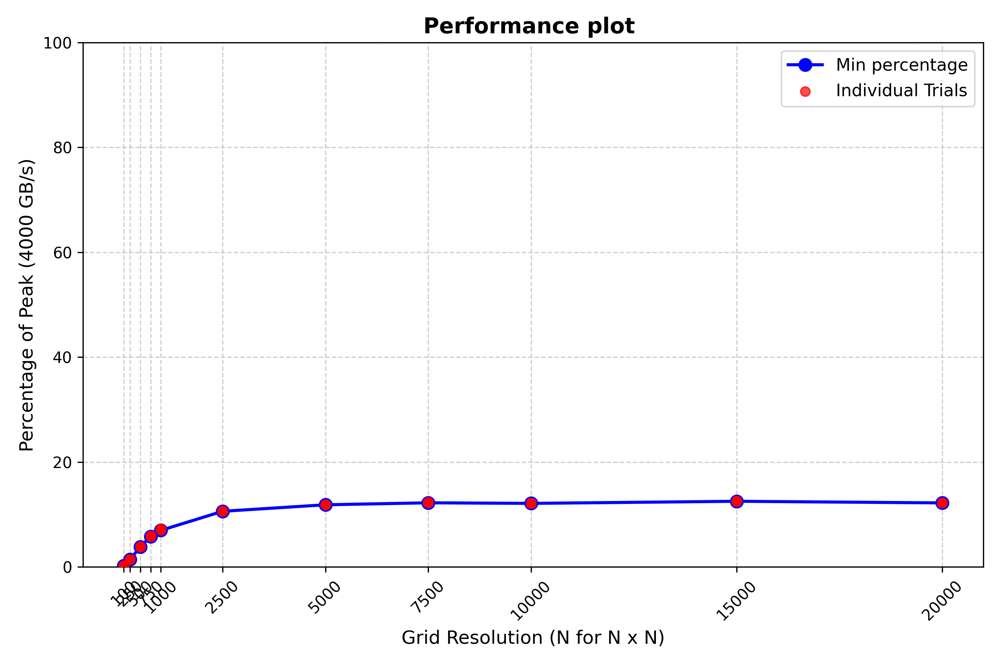
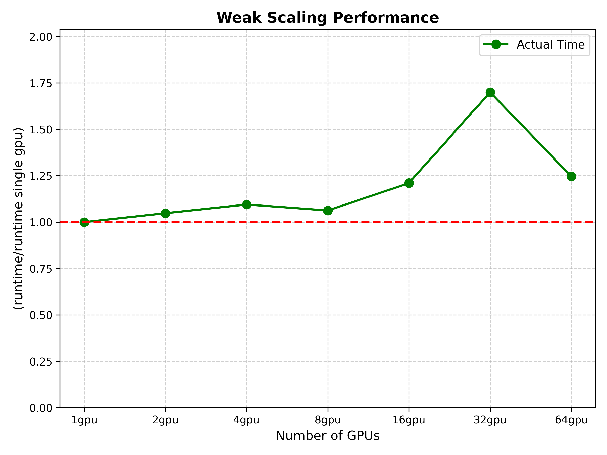
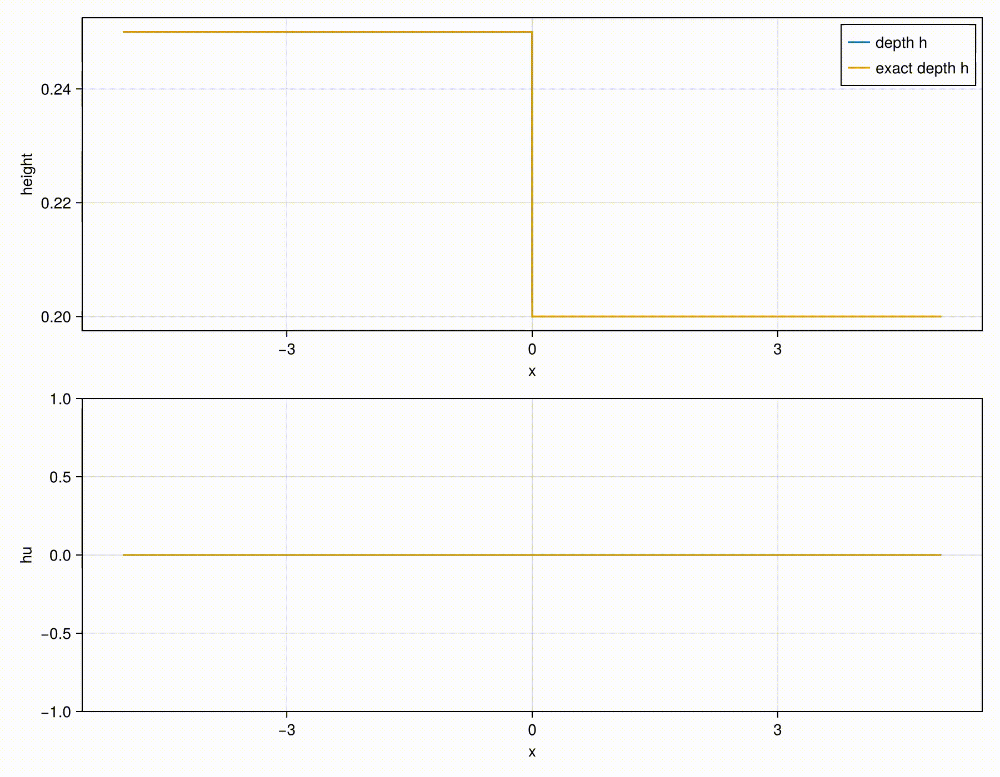
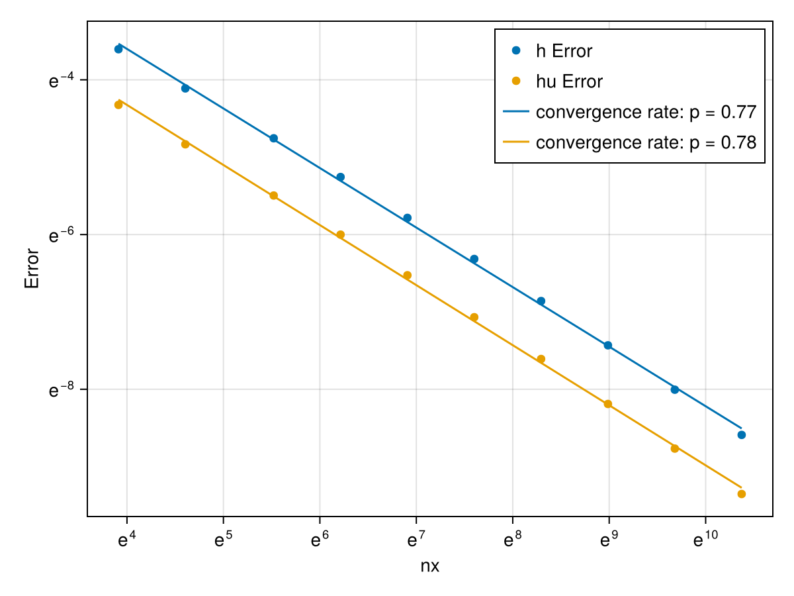
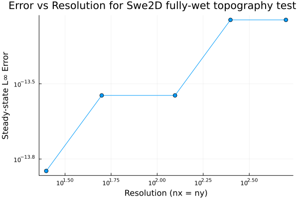
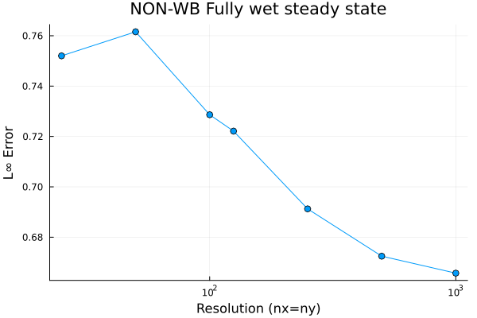
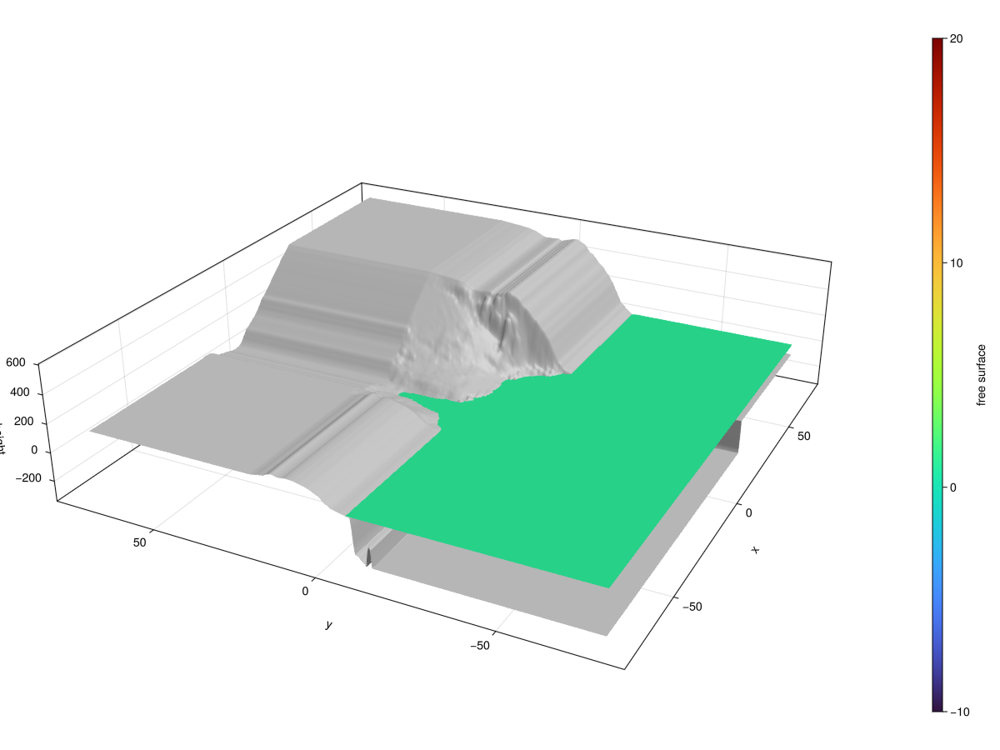
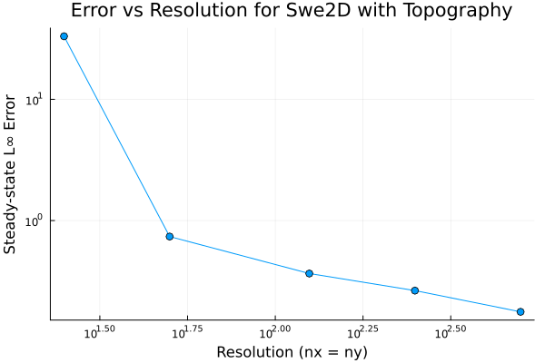

# ShallowWaterEquations

[](https://github.com/S1ntax3rror/ShallowWater4PDEonGPU/actions/workflows/CI.yml)  

**Project info**

This repository is the final project for the course *Solving partial differential equations in parallel on GPUs II* at ETH Zürich.  
Authors: *Ramura Gassler (rgassler@ethz.ch), Jiri Käser (jikaeser@ethz.ch)*.

The main goal of this project is the development of **parallel 2D shallow-water equation (SWE) solvers** in Julia. The final repo includes:

- a **single-XPU** implementation using [`ParallelStencil.jl`](https://github.com/omlins/ParallelStencil.jl), running on CPUs or GPUs from one code base,
- a **multi-XPU** implementation using [`ImplicitGlobalGrid.jl`](https://github.com/eth-cscs/ImplicitGlobalGrid.jl), extending the solver to domain-decomposed MPI runs,
- a **well-balanced wet/dry solver** for shallow-water flow over non-flat bathymetry,
- CPU and reference implementations for verification,
- visualization and post-processing scripts for generated simulation output.

The numerical focus is a first-order finite-volume SWE solver with Rusanov fluxes following [1], bottom topography, and a free-surface-based well-balanced wet/dry treatment adapted from [3]. The solver further includes wet/dry stabilization and an absorbing sponge layer. Visualization and post-processing are based on ideas from [2]. The software focus follows a similar workflow as the PorousConvection project from the first part of this course: start from a serial/reference formulation, port the solver to a single CPU/GPU backend with `ParallelStencil.jl`, and then extend it to distributed multi-XPU simulations with `ImplicitGlobalGrid.jl`.

## Contents

- [Introduction](#introduction)
- [Physical model](#physical-model)
- [Numerical method and parallelisation](#numerical-method-and-parallelisation)
- [Setup](#setup)
- [Run the simulations](#run-the-simulations)
- [Repository structure](#package-repository-structure)
- [Documentation for each script](#documentation-for-each-script)
- [Adding topography and extending to 2D](#adding-topography-and-extending-to-2d)
- [2D SWE single-XPU solver](#2d-swe-single-xpu-solver)
- [2D well-balanced SWE single-XPU solver](#2d-well-balanced-swe-single-xpu-solver)
- [2D well-balanced SWE multi-XPU solver](#2d-well-balanced-swe-multi-xpu-solver)
- [Diagnostics, reference solutions, and testing](#diagnostics-reference-solutions-and-testing)
- [Visualization and output processing](#visualization-and-output-processing)
- [Discussion and outlook](#discussion-and-outlook)
- [References](#references)

---

## Introduction

The shallow water equations describe depth-averaged free-surface flows in regimes where the horizontal length scale is much larger than the water depth. They are widely used for wave propagation, dam-break problems, tsunami modelling, coastal inundation, and flow over varying bathymetry.

From a numerical point of view, the shallow water equations are challenging because they combine:

- nonlinear hyperbolic wave propagation,
- source terms caused by bottom topography,
- equilibrium states such as a **lake at rest**,
- wet/dry interfaces where water depth approaches zero,
- large explicit finite-volume workloads that are well suited for data-parallel execution.

This project therefore has two tightly connected goals:

1. **Develop a physically robust SWE solver**
   - conservative finite-volume discretisation,
   - Rusanov numerical fluxes,
   - topographic source terms,
   - well-balanced lake-at-rest treatment,
   - wet/dry stabilization and draining timestep,
   - absorbing sponge layers for outgoing waves.

2. **Parallelise the solver efficiently**
   - CPU/GPU backend abstraction through `ParallelStencil.jl`,
   - stencil-style kernels written once and executed on different backends,
   - multi-XPU domain decomposition through `ImplicitGlobalGrid.jl`,
   - halo exchange and global reductions for distributed simulations,
   - shell scripts cluster execution. 

## Physical model

### Conserved variables

For the 2D shallow water equations, the conserved state is

$$
U =
\begin{bmatrix}
h\\
hu\\
hv
\end{bmatrix},
$$

where

- $h(x,y,t)$ is the water depth,
- $u(x,y,t)$ is the depth-averaged velocity in the $x$-direction,
- $v(x,y,t)$ is the depth-averaged velocity in the $y$-direction,
- $hu$ and $hv$ are the depth-integrated momentum components,
- $z(x,y)$ denotes the fixed bottom topography.

The free-surface elevation is

$$
\eta = h + z.
$$

### Governing equations

The 2D SWE with fixed bathymetry are

$$
\partial_t h + \partial_x(hu) + \partial_y(hv) = 0,
$$

$$
\partial_t(hu) + \partial_x\left(hu^2 + \frac{1}{2}gh^2\right) + \partial_y(huv) = -gh\,\partial_x z,
$$

$$
\partial_t(hv) + \partial_x(huv) + \partial_y\left(hv^2 + \frac{1}{2}gh^2\right) = -gh\,\partial_y z.
$$

In balance-law form,

$$
\partial_t U + \partial_x F(U) + \partial_y G(U) = S(U),
$$

with

$$
F(U) = \begin{bmatrix} hu\, hu²+\frac{1}{2}gh^2, huv \end{bmatrix}, \qquad G(U) = \begin{bmatrix} hv, huv ,hv²+\frac{1}{2}gh^2 \end{bmatrix},
$$

and

$$
S(U) =
\begin{bmatrix}
0,
-gh\partial_x z, 
-gh\partial_y z
\end{bmatrix}.
$$

### Lake-at-rest equilibrium

A central steady state is the lake-at-rest solution

$$
u=v=0,
\qquad
\eta=h+z=\text{constant}.
$$

A method is **well-balanced** if it preserves this equilibrium exactly, up to roundoff.[3]

---

## Numerical method and parallelisation

### Finite-volume update

The computational domain is divided into Cartesian cells.  
Each cell $(i,j)$ stores

$$
U_{i,j} =
\begin{bmatrix}
h_{i,j}\\
(hu)_{i,j}\\
(hv)_{i,j}
\end{bmatrix}.
$$

The explicit first-order finite-volume update is

$$
U^{n+1}_{i,j} = U^n_{i,j} - \frac{\Delta t}{\Delta x} \left( F_{i+1/2,j}-F_{i-1/2,j} \right) -
\frac{\Delta t}{\Delta y}
\left(
G_{i,j+1/2}-G_{i,j-1/2}
\right)
+
\Delta t\,S_{i,j}.
$$

The implemented workflow uses:

- piecewise-constant reconstruction,
- explicit timestepping,
- Rusanov / local Lax–Friedrichs fluxes,
- CFL-based timestep selection,
- reflective or absorbing outer-domain treatment depending on the script,
- optional visualization or serialized array output.

### Rusanov flux

In the $x$-direction,

$$
\widehat{F}(U_L,U_R) = \frac{1}{2} \left[ F(U_L)+F(U_R) \right] -
\frac{1}{2}
a_{\max}
\left(
U_R-U_L
\right),
$$

where

$$
a_{\max} =
\max
\left(
|u_L|+\sqrt{gh_L},
|u_R|+\sqrt{gh_R}
\right).
$$

In the $y$-direction,

$$
\widehat{G}(U_L,U_R) = \frac{1}{2} \left[ G(U_L)+G(U_R) \right] -
\frac{1}{2}
b_{\max}
\left(
U_R-U_L
\right),
$$

with

$$
b_{\max} =
\max
\left(
|v_L|+\sqrt{gh_L},
|v_R|+\sqrt{gh_R}
\right).
$$

### CFL timestep

The explicit timestep is chosen from a CFL condition.  
A representative 2D form is

$$
\Delta t =
\frac{\mathrm{CFL}}
{
\max_{i,j}
\left(
\frac{|u_{i,j}|+\sqrt{gh_{i,j}}}{\Delta x}
+
\frac{|v_{i,j}|+\sqrt{gh_{i,j}}}{\Delta y}
\right)
}.
$$

The multi-XPU solver computes local speed extrema and uses MPI reductions to obtain globally consistent timestep information.

### Well-balanced free-surface reconstruction

A standard topographic finite-volume discretisation is not automatically well-balanced.  
If the mass flux diffuses $h_R-h_L$, then even a lake at rest may generate artificial transport because

$$
h_R-h_L \neq 0
$$

over non-flat bathymetry, even when

$$
\eta_R-\eta_L = 0.
$$

The well-balanced implementation therefore reconstructs the free surface

$$
\eta=h+z
$$

and evaluates interface water depths against a face bathymetry.

At the $x$-interface $i+1/2,j$,

$$
z_{i+1/2,j} =
\frac{z_{i,j}+z_{i+1,j}}{2},
$$

$$
\eta_L=h_{i,j}+z_{i,j},
\qquad
\eta_R=h_{i+1,j}+z_{i+1,j},
$$

$$
h_L =
\max\left(0,\eta_L-z_{i+1/2,j}\right),
$$

$$
h_R =
\max\left(0,\eta_R-z_{i+1/2,j}\right).
$$

The same construction is used at $y$-interfaces.

### Well-balanced mass flux

The core first-order replacement is

$$
\boxed{
F_{1,i+1/2,j} =
\frac{1}{2}\left[(hu)_L+(hu)_R\right] -
\frac{1}{2}a_{i+1/2,j}(\eta_R-\eta_L)
}
$$

instead of diffusing $h_R-h_L$.  
Similarly,

$$
\boxed{
G_{1,i,j+1/2} =
\frac{1}{2}\left[(hv)_L+(hv)_R\right] -
\frac{1}{2}b_{i,j+1/2}(\eta_R-\eta_L)
}.
$$

At lake at rest,

$$
\eta_R-\eta_L=0,
$$

so no artificial mass flux is generated.

### Well-balanced source term

For cell $(i,j)$ define

$$
z_E = \frac{z_{i,j}+z_{i+1,j}}{2},
\qquad
z_W = \frac{z_{i-1,j}+z_{i,j}}{2},
$$

$$
z_N = \frac{z_{i,j}+z_{i,j+1}}{2},
\qquad
z_S = \frac{z_{i,j-1}+z_{i,j}}{2}.
$$

Let

$$
\eta_C=h_{i,j}+z_{i,j}.
$$

Then the face depths used by the source term are

$$
h_E=\max(0,\eta_C-z_E),
\qquad
h_W=\max(0,\eta_C-z_W),
$$

$$
h_N=\max(0,\eta_C-z_N),
\qquad
h_S=\max(0,\eta_C-z_S).
$$

The source terms are discretised as

$$
S^{(2)}_{i,j} =
-g\,
\frac{h_E+h_W}{2}
\frac{z_E-z_W}{\Delta x},
$$

$$
S^{(3)}_{i,j} =
-g\,
\frac{h_N+h_S}{2}
\frac{z_N-z_S}{\Delta y}.
$$

In the fully wet lake-at-rest case, this discrete source treatment cancels the hydrostatic pressure imbalance.

### Wet/dry stabilization

Near shorelines, direct division

$$
u=\frac{hu}{h},
\qquad
v=\frac{hv}{h}
$$

can produce unstable velocities when $h$ is very small.  
The well-balanced scripts therefore use a desingularized velocity evaluation:

$$
\boxed{
u =
\frac{
\sqrt{2}\,h\,(hu)
}{
\sqrt{h^4+\max(h^4,\varepsilon_{\mathrm{vel}})}
}
}
$$

$$
\boxed{
v =
\frac{
\sqrt{2}\,h\,(hv)
}{
\sqrt{h^4+\max(h^4,\varepsilon_{\mathrm{vel}})}
}
}
$$

with

$$
\varepsilon_{\mathrm{vel}} =
\min(\Delta x,\Delta y)^4.
$$

The scripts additionally apply dry-cell cleanup:

$$
h<h_\varepsilon
\quad\Longrightarrow\quad
h=0,\qquad hu=0,\qquad hv=0.
$$

### Draining timestep

To prevent a cell from losing more water than it contains during one update, a first-order draining timestep is applied.  
For cell $(i,j)$,

$$
R_{i,j} =
\frac{
\max(F_{1,E},0)+\max(-F_{1,W},0)
}{\Delta x}
+
\frac{
\max(G_{1,N},0)+\max(-G_{1,S},0)
}{\Delta y}.
$$

The local draining time is

$$
\Delta t^{\mathrm{drain}}_{i,j} =
\begin{cases}
\min\left(\Delta t,\dfrac{h_{i,j}}{R_{i,j}}\right), & \text{if } R_{i,j} > 0, \\
\Delta t, & \text{if } R_{i,j} = 0.
\end{cases}
$$

Outgoing face fluxes use the draining timestep of the upwind donor cell.

### Absorbing sponge layer

The 2D wave simulations use an enlarged computational domain together with a sponge layer near the outer region.  
The sponge layer damps momentum according to

$$
hu \leftarrow (1-\sigma)\,hu,
\qquad
hv \leftarrow (1-\sigma)\,hv.
$$

This is separate from the wet/dry treatment.  
Its role is to reduce artificial boundary reflections when waves propagate away from the area of interest.

---

### ParallelStencil.jl: single-XPU implementation

Find the parallel 2D implementations at `src/xpu/`.

To enable GPU utilization set 
```julia
USE_GPU=true
```

We use the parallel stencil library to easily switch between CPU and GPU version (XPU implementation).

Most of the work is done in parallel kernels structured as

```julia
@parallel_indices (ix, iy) function kernel!(...)
    do_work()
end
```

The well-balanced XPU code includes parallel kernels for:

- interface wave-speed computation,
- Rusanov flux evaluation,
- draining timestep computation,
- flux-based water-depth updates,
- momentum updates with topographic source terms,
- wet/dry cleanup,
- sponge-layer damping.

### ImplicitGlobalGrid.jl: multi-XPU implementation

The multi-XPU solver is essentially the XPU solver but it utilizes the ImplicitGlobalGrid and MPI libraries. The sponge layer was removed as rendering large domains is not a problem when using multi-GPU.

It essentially splits up the full domain into similar sized subdomains and distributes them such that each GPU and or CPU receives one subdomain.

Neighbour exchanges are handled via update_halo from ImplicitGlobalGrid. We use the @hide_communication pattern for both halo updates however the first halo exchange is most likely still producing communication overhead as the kernel is too small to hide all communication. 

The timestep requires a reduction which causes some communication overhead. To reduce this a conservative timestep is chosen every 10 timesteps and used for the next 10 timesteps. Should the timestep for any subdomain require to become larger than the 0.99*CLF condition a warning will be printed. This warning never showed up in any of our simulations. If this shows up the conservative timestep is still chosen too large and should be reduced slightly more.

### Water Visualization

Water surfaces are rendered from the simulated water height $h$ and bathymetry $z$, with the free surface defined as

$$
\eta = z + h.
$$

The visualization uses `GLMakie.jl` to render both the terrain and the water surface in 3D. The water shading is inspired by [2]: depth-dependent transparency and color tinting are combined with Beer–Lambert attenuation, a Schlick-type Fresnel reflection approximation, and simple specular highlights to improve the visual distinction between shallow and deep regions. Surface normals estimated from the free-surface geometry are used to modulate reflections and lighting.

## Setup

**Julia:** ≥ 1.9 recommended

**Main packages used across the repository:**

- `ParallelStencil`
- `ImplicitGlobalGrid`
- `MPI`
- `CUDA`
- `GLMakie`
- `StaticArrays`
- `Serialization`
- `Random`
- `Printf`

Instantiate the project environment from the repository root:

```bash
julia --project -e 'using Pkg; Pkg.instantiate()'
```

The repository contains additional implementation notes in:

- `src/2d_with_z/README.md`
- `src/xpu/README.md`

These can document solver-specific settings and script-level workflows.

## Run the simulations

### Local Julia execution

From the repository root, individual scripts can be started with

```bash
julia --project src/xpu/2d_swe_xpu.jl
```

or, for the well-balanced single-XPU implementation,

```bash
julia --project src/xpu/2d_swe_xpu_wb.jl
```

The CPU implementation can be run through

```bash
julia --project src/xpu/2d_swe_cpu.jl
```

### Provided shell scripts

The `run_files/` folder slurm scripts. Check the README in that folder for more information.

### Single-XPU workflow

Typical development runs use the XPU scripts.

To enable GPU support set 
```julia
const USE_GPU = true
```

Representative commands:

```bash
julia --project src/xpu/2d_swe_xpu.jl
julia --project src/xpu/2d_swe_xpu_wb.jl
```

### Multi-XPU workflow

To test locally use:

```bash
mpiexecjl -n 8 julia --project src/xpu/2d_swe_multi_xpu_wb.jl --nx 100 --ny 100 
```

To run at fullscale use the slurm scripts provided.

## :package: Repository Structure

```bash
├─ data/                                  # Input topography or wave-related data
├─ docs/                                  # Result figures, animations, and presentation related
├─ run_files/                             # Slurm scripts
│ ├─ run_2D_swe_compression.sh
│ ├─ run_2D_swe_multi_xpu.sh
│ ├─ run_2D_swe_xpu_wb.sh
│ └─ run_2D_swe_xpu.sh
├─ src/                                   # Numerical solvers and utilities
│ ├─ 1D_reference/                        # 1D SWE reference
│ ├─ 1D_with_z/                           # 1D SWE with bottom topography
│ ├─ 2d_with_z/                           # Baseline 2D SWE implementation with topography
│ ├─ viz/                                 # Visualization scripts
│ ├─ xpu/                                 # Parallel CPU/GPU and multi-XPU SWE solvers
│ │ ├─ 2d_swe_multi_xpu_wb.jl
│ │ ├─ 2d_swe_multi_xpu.jl
│ │ ├─ 2d_swe_xpu_error_benchmark.jl
│ │ ├─ 2d_swe_xpu_wb.jl
│ │ ├─ 2d_swe_xpu.jl
│ │ ├─ output_compression.jl
│ └─ reference.jl                         # Auxiliary reference implementation
├─ .gitignore
├─ Manifest.toml
├─ Project.toml
└─ README.md
```

## Documentation for each script

As stated in the introduction, this project followed the approach of the Porousconvection project from the first part of this course closely. This means that we started off on a 1D version. After validation of the 1D version we extended it to a 2D version. The 2D version was then ported to XPU and multi-XPU for the final scripts. As our first solver did not preserve the steady state we implemented a second XPU version with the well-balanced (wb) scheme.

### Adding topography and extending to 2D

```bash
src/1D_reference/
src/1D_with_z/
```

The reference script was the starting point for us. Based on this we implemented our first solver which is the 1D_with_z version that contains a z layer allowing to set a bathymetry and topography.

This version was used to validate our solver against analytical solutions using the classical dam-break example.


*Dam break comparing analytical version vs our numeric solver.*

Next we extended the 1d version to 2d which is located at

```bash
src/2d_with_z/
```

This coordinate extension required introducing x and y fluxes and splitting the state into h(water height), hv(momentum x) and hu(momentum y).

<video src="docs/animations/Validation/2d_swe_topo.mp4" controls="controls" muted="muted" autoplay="autoplay" loop="loop" playsinline="playsinline" style="max-width: 100%;">
  Your browser does not support the video tag.
</video>

*This animation shows the output of `2d_swe.jl`.* 

### 2D SWE single-XPU solver

The final non-well-balanced parallel solver is

```bash
src/xpu/2d_swe_xpu.jl
```

The single-XPU extends the `2d_with_z` solver using `ParallelStencil.jl`. In doing so we introduced Kernels for optimal parallel computation and all arrays were transformed to the ParralelStencil `Data.Arrays` allowing to switch between CPU and GPU.

Also domain expansion was added. Essentially the area of interest (AOI) is extended in all directions and the sponge layer is only applied on the N outermost layers. This ensures that the sponge layer does not produce artifacts inside the simulated domain and if the domain multiplication factor is chosen large enough, no waves will be reflected back to the AOI. Only the AOI is visualized.

This version includes a topography loader which can import topography as well as water level data.

### 2D well-balanced SWE single-XPU solver

Find the well balanced solver at

```bash
src/xpu/2d_swe_xpu_wb.jl
```

This is a `ParallelStencil.jl` implementation of the above described well-balanced numerical scheme. Everything stated for is section [2D SWE single-XPU solver](#2d-swe-single-xpu-solver) also applies here.


#### Performance analysis

In order to asses how well our solver is capable of utilizing the available memory bandwidth, we applied the performance analysis technique presented in [lecture 7 of the first part of this course](https://pde-on-gpu.vaw.ethz.ch/lecture7/). We do only reach 12.5% of the available 4000 GB/s memory bandwidth. Check the performance plot below. 

When comparing to the lecture we can see that the kernels used there were much smaller than the ones we require and those kernels reached about 50% of the maximum throughput. Based on this we do believe that reaching 20-30% of maximum throughput is possible but would require massive restructuring of the kernels. 

Right now we start many smaller kernels. We believe that this causes some overhead. This could be addressed by merging some of our Kernels together however if the Kernels become too large other issues start to show up. We attempted to do this but in the end this only made performance worse and as we can simulate 20000x20000 gridpoints for thousands of time-steps withing minutes (seconds on multi-GPU) we rather focused our resources on visualization, importing, terrain generation and MULTI-GPU. Note that at 20000x20000 gridpoints the memory limit is almost reached on single GPU.




### 2D well-balanced SWE multi-XPU solver

The distributed implementation is

```bash
src/xpu/2d_swe_multi_xpu_wb.jl
```

For general information check [general multi-xpu impl](#implicitglobalgridjl-multi-xpu-implementation)

It uses the same physical model and well-balanced reconstruction as the single-XPU solver, but adds:

- distributed grid initialization,
- halo exchange,
- MPI-based global extrema/reductions,
- distributed serialization or visualization output

The boundary exchange and the bathymetry + topography loader required larger modifications to deal with the MPI domains.

#### Code-level multi-XPU

The solver follows the pattern

```julia
me, dims, nprocs, coords, comm_cart =
    init_global_grid(nx, ny, 1; select_device=false)
```

then, during time stepping,

```julia
update_halo!(h, hu, hv)
```

and at the end,

```julia
finalize_global_grid()
```

#### Scaling analysis

In order to asses how well our multi-gpu version is scaling, we compared the minimum runtime on single GPU to the minimum runtime on x GPUs. Each GPU received a 2000x2000 domain meaning we apply a standard weakscaling analysis. Check the Weak Scaling Performance plot for reference. The dashed line shows how optimal scaling would look like.

The Weak Scaling plot shows that up to 8 GPUs the scaling works almost perfect. For 64 GPUs the runtime increased to 1.25x which is suboptimal. We believe this stems from the first halo update which we attempt to hide behind a small kernel update. This kernel is likely too small to cover the full communication which causes some overhead for larger amounts of GPUs. At 32 GPUs our runtime increased to 1.75x which is surprising. We are not sure why this happens but it might be due to the MPI domain layout.



## Diagnostics, Reference Solutions, and Testing

The verification strategy is built around the shared solver routines in `src/solvers.jl`. For the sequential 1D and 2D implementations, the solver functions defined there are called at every timestep of a simulation and perform the full state update. These routines therefore provide the central reference point for our diagnostics and testing.

Our diagnostics focus on verifying the numerical building blocks before assessing complete benchmark simulations. In particular, we compare timestep updates, flux computations, and physically relevant verification cases to ensure that the implemented schemes behave as expected.

For quantitative error analysis, we use the discrete $L^1$ and $L^\infty$ norms. Given a numerical solution $u_i$ and a reference solution $u_i^{\mathrm{ref}}$, the errors are defined as

$$
E_{L^1} = \Delta x \sum_i \left|u_i - u_i^{\mathrm{ref}}\right|,
$$

and

$$
E_{L^\infty} = \max_i \left|u_i - u_i^{\mathrm{ref}}\right|.
$$

The $L^1$ error measures the total accumulated deviation, while the $L^\infty$ error captures the largest pointwise discrepancy.

### Reference Solutions

The reference-testing workflow starts from `src/1D_reference/reference.jl`, which contains the baseline 1D shallow-water solver provided by Prof. Ivan Utkin. This implementation is used as the primary reference for validating our sequential 1D shallow-water solver.

The 1D solver with topography is reference-tested through the solver function in `solvers.jl` for a single timestep. For a flat bottom, the topography-aware solver should reproduce the same update as the baseline reference implementation. This comparison is performed directly in the test suite by evolving both states once from identical random initial data and checking that the resulting water height and momentum agree within numerical tolerance.

In addition, the 1D topography implementation is verified using the dam-break problem, where the numerical solution is compared against the analytical Riemann solution. This provides a physically interpretable benchmark beyond direct code-to-code comparison.


*Numerical solution of the one-dimensional dam-break problem compared with the analytical Riemann solution, showing the rarefaction wave and shock wave.*

* $L^1$ error for the one-dimensional dam-break benchmark, measuring the average deviation of the numerical solution from the analytical reference solution.*

For the non-well-balanced 2D XPU implementation, verification is performed on the CPU backend. The most important kernel-level quantity, namely the numerical flux computation, is unit-tested against the corresponding sequential 2D solver. Random states are generated, the sequential solver computes the reference fluxes, and the XPU kernel fluxes are then compared component-wise at sampled grid locations.

After establishing these checks for the non-well-balanced schemes, we introduced the well-balanced formulation. Its main verification case is the lake-at-rest configuration, where a stationary free surface over nontrivial topography should remain at rest. This test directly checks the defining property of the well-balanced scheme: the numerical balance between flux gradients and source terms.


*Initial condition and topography for the fully wet lake-at-rest benchmark.*


*Error evolution for the fully wet lake-at-rest test. The well-balanced scheme preserves the steady state up to machine precision.*


*Error evolution for the fully wet lake-at-rest test. The non-well-balanced scheme cannot preserve the steady state, no clear convergence eighter.*


*Initial condition and topography for the partially wet lake-at-rest benchmark, including wet and dry regions.*


*Error evolution for the partially wet benchmark. The steady state is not preserved exactly, but the well-balanced scheme shows convergent error behavior.*


### Testing

The automated tests are collected in the Julia package `ShallowWaterWB`. From Julia package mode, they can be executed with

```julia
pkg> test ShallowWaterWB
```

This launches the test suite defined in `test/runtests.jl`. The current suite includes:

- `test_1d_reference.jl`, which verifies the 1D topography solver against the baseline 1D reference solver for one timestep on a flat bottom;
- `test_seq_vs_xpu.jl`, which compares the 2D XPU flux kernel, executed on the CPU backend, against the fluxes produced by the sequential 2D solver.

The unit tests use approximate floating-point comparisons with fixed relative and absolute tolerances. This makes the tests robust to negligible roundoff differences while still detecting meaningful implementation errors.

The same tests are also executed automatically in continuous integration whenever changes are pushed to GitHub, ensuring that the core verification checks remain active throughout development.

## Visualization and output processing

The repository contains dedicated visualization and output utilities:

```bash
src/viz/plot_multi.jl
src/viz/plot_ray.jl
src/xpu/output_compression.jl
```

The solver workflow can produce:

- live Makie visualizations when `GLMakie` is available,
- saved frames in `frames/`,
- serialized array output for later post-processing,
- compressed or reorganized output for visualization pipelines.

Representative post-processing commands can be adapted as:

```bash
julia --project src/viz/plot_multi.jl
julia --project src/viz/plot_ray.jl
julia --project src/xpu/output_compression.jl
```

## Discussion and outlook

- The main achievement of this project is the transition from baseline SWE implementations to **parallel single-XPU and multi-XPU solvers** following the same development philosophy as the PorousConvection project.
- `ParallelStencil.jl` enables a compact implementation of the core finite-volume update that can run on both CPU and GPU.
- `ImplicitGlobalGrid.jl` extends the same solver structure to distributed-memory domain decomposition with halo exchange and MPI reductions.
- The well-balanced wet/dry treatment addresses an essential physical issue of SWE simulations over non-flat bathymetry: preserving lake-at-rest equilibria and avoiding unstable shoreline behaviour.
- The absorbing-domain setup makes the solver more suitable for wave-propagation experiments where reflections from the outer boundary should be reduced.
- The repository combines numerical modelling, parallel programming, benchmarking, and post-processing in a coherent GPU-oriented PDE project.

Natural extensions include:

- stronger formal test coverage,
- second-order reconstruction and slope limiting,
- higher-order wet/dry treatment,
- systematic comparison of CPU, single-XPU, and multi-XPU results,
- testing the solver on Swiss topography and bathimetry
- enabling full memory usage when loading topographies on multi-XPU

## References

1. E. F. Toro, *Riemann Solvers and Numerical Methods for Fluid Dynamics*, Springer, 2009.
2. D. Swientek, *Interactive Visualization of Shallow Water Equation Solvers*, Bachelor’s thesis, Friedrich-Alexander-Universität Erlangen-Nürnberg, 2018.
3. S. Hwang, P. J. Lynett, and S. Son, “A second-order well-balanced reconstruction for the shallow flows with wet/dry fronts,” *Computers and Mathematics with Applications*, vol. 208, pp. 33–54, 2026. doi: 10.1016/j.camwa.2026.01.036.
4. Generative AI was used for plotting scripts, debugging and Documentation espacially README.md formatting and modifications.
